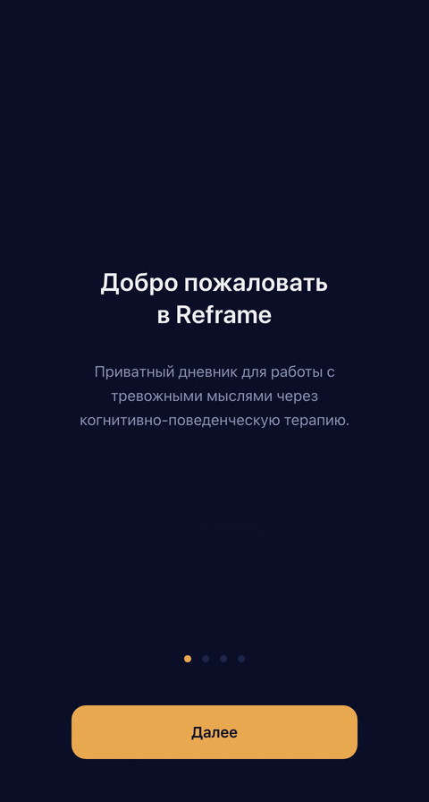

# Reframe

> Приватный голосовой КПТ-дневник, созданный с помощью AI-ассистированной разработки.
>
> 

## Что это

Reframe помогает профессионалам справляться со стрессом через когнитивный рефрейминг. Вы говорите о том, что вас тревожит — приложение анализирует речь через призму когнитивно-поведенческой терапии Дэвида Бёрнса и предлагает новый, нейтральный взгляд на ситуацию.

**Все данные остаются только на вашем устройстве.** Никаких серверов, никакой телеметрии.

## Как это работает

1. Оцените уровень тревоги (1–10)
2. Расскажите о ситуации — просто говорите
3. Проверьте расшифровку, подтвердите или перезапишите
4. Приложение найдёт когнитивные искажения в ваших мыслях (10 типов по Бёрнсу, с пояснениями)
5. Получите рефрейминг — фактологический взгляд стороннего наблюдателя
6. Опционально: «Копнуть глубже» — Vertical Arrow для выявления глубинных убеждений
7. Оцените тревогу после и отслеживайте прогресс в сводке и облаке тегов

### AI в основе продукта

**LLM-интеграция**: каждое обращение пользователя анализирует большая языковая модель (DeepSeek). Бэкенд — тонкий прокси, провайдера можно заменить без изменения кода.

**Промпт-инжиниринг**: системный промпт построен на методологии КПТ Дэвида Бёрнса («Терапия настроения»). 10 когнитивных искажений, техника трёх колонок, сократический диалог — всё это «зашито» в инструкцию для LLM. Результат — не банальный совет, а клинически обоснованный рефрейминг.

**Локальная разработка**: мок-режим (готовые КПТ-ответы без API-ключа) позволяет итерировать промпт локально, не тратя деньги на вызовы LLM.

## Как это создано

Reframe построен с помощью **AI-ассистированной разработки**: от идеи до продакшена — через автоматизированный конвейер, где AI-агенты пишут код, тесты и деплоят, а человек задаёт направление.

### Spec-Driven Development
Каждая фича начинается со спецификации, а не с кода. Полный цикл:
```
constitution → specify → plan → tasks → implement
```
Артефакты (принципы, требования, архитектура, задачи) — в репозитории, всегда актуальны.

### Инструменты
- **Speckit** — spec-driven фреймворк для структурирования требований
- **OpenCode** — оркестрация AI-агентов, параллельное выполнение задач
- **TDD** — 27 E2E + 19 unit-тестов, strict TypeScript, ни строчки без теста
- **CI/CD** — GitHub Actions: lint → test → build → e2e → деплой на VDS

### Результат
Полный продукт — от архитектуры до деплоя — создан за несколько сессий AI-ассистированной работы. Speckit-артефакты документируют каждый шаг.

### Ход разработки

```
┌─ Планирование ────────────────────────────────────────┐
│ constitution v1 → v2 → v3    (3 итерации)              │
│ spec.md                      (уточнение требований)     │
│ plan.md                      (техническая архитектура)  │
│ tasks.md                     (65 атомарных задач)       │
└────────────────────────────────────────────────────────┘
                         ↓
┌─ Реализация ─────────────────────────────────────────┐
│ Фаза 1-7: инфраструктура, бэкенд, UI, голос, сессии  │
│ 92 pull request'ов, каждый с CI-валидацией              │
│ 27 E2E + 19 unit-тестов                               │
│ Баги найдены и исправлены в процессе                  │
└───────────────────────────────────────────────────────┘
                         ↓
┌─ Итерации ───────────────────────────────────────────┐
│ UI-редизайн (navy/amber, центральная композиция)      │
│ КПТ-глубина (трёхколоночный вывод)                    │
│ Vertical Arrow (глубинные убеждения по Бёрнсу)         │
│ Живой текст при записи                                │
│ График → сводка + облако тегов                        │
│ Дыхательное упражнение (4-4-4)                        │
│ Темы-подсказки (10+ тем, 5 категорий)                 │
└───────────────────────────────────────────────────────┘
                         ↓
┌─ Продакшен ──────────────────────────────────────────┐
│ VDS, HTTPS, CI/CD                                     │
│ https://reframe.vaganov-vadim.ru                      │
└───────────────────────────────────────────────────────┘
```

### Скорость разработки

Первая версия — 4 часа AI-времени. Но главное — не это.

**Построен конвейер.** Теперь добавление новой фичи выглядит так:

```
specify → plan → tasks → implement → CI/CD → продакшен
         ↑                              ↓
    (speckit)                    (авто-деплой)
```

Ноль рутины. Спецификация → архитектура → код → тесты → деплой — всё автоматизировано. Скорость внесения изменений измеряется минутами, а не днями.

---

## Технические принципы

- **Приватность прежде всего**: все данные на устройстве пользователя, бэкенд — тонкий прокси без хранения
- **Два стека — осознанный выбор**: TypeScript + React для UI, Clojure + Kit для бэкенда
- **КПТ по Бёрнсу**: 10 когнитивных искажений, техника трёх колонок, сократический диалог
- **Защищено**: HTTPS, rate limiting

## Архитектура

```
Пользователь (Chrome) → React SPA → Clojure прокси → LLM API
                        ↕
                  Данные на устройстве
```

## Попробовать

https://reframe.vaganov-vadim.ru

## Документация

- [Техническая документация](ENGINEERING.md) — запуск, стек, CI/CD
- [Конституция проекта](.specify/memory/constitution.md) — принципы и границы
- [Спецификация](.specify/memory/spec.md) — функциональные требования
- [Технический план](.specify/memory/plan.md) — архитектура и детали
- [План развития](ROADMAP.md) — roadmap проекта
- [AI-процесс](AGENTS.md) — как AI-агенты работают с проектом
